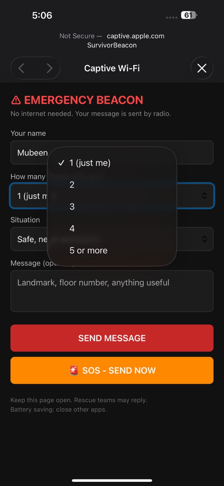
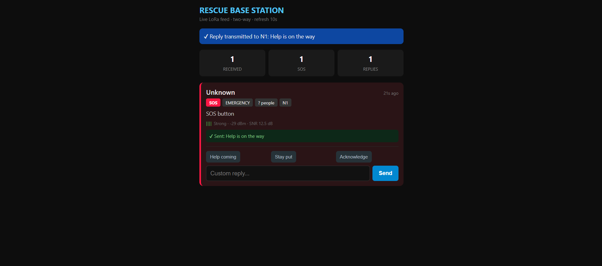
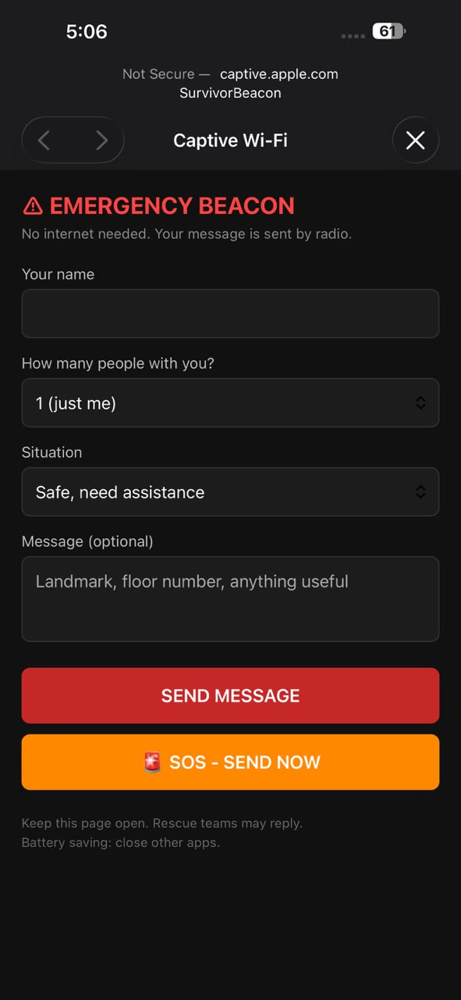
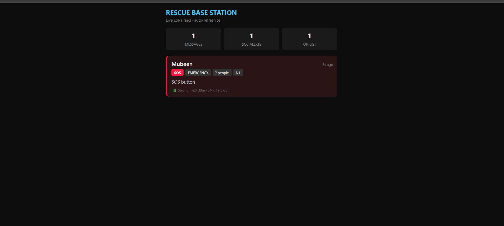
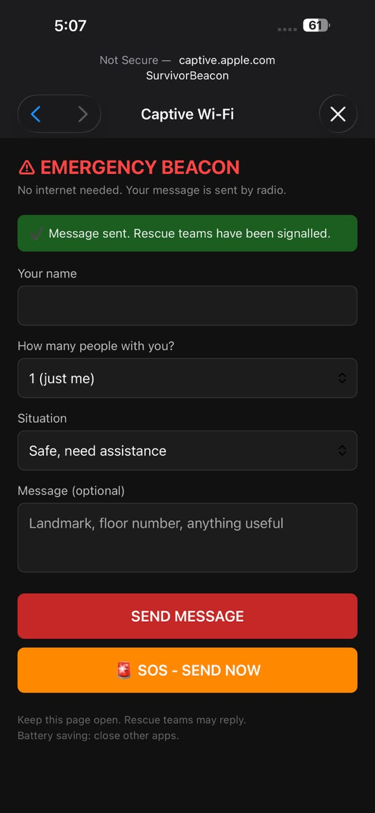
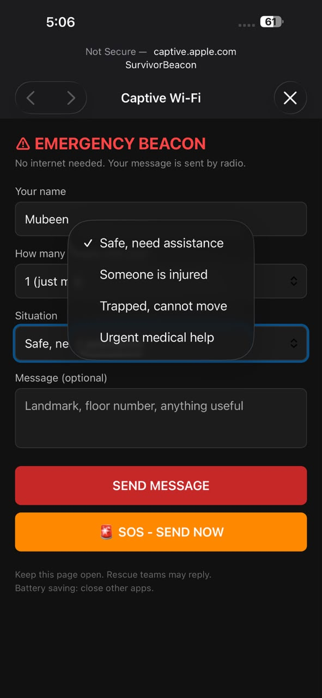
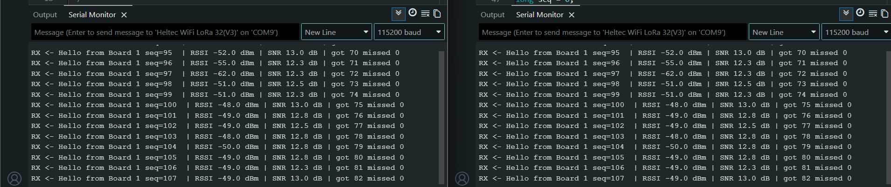
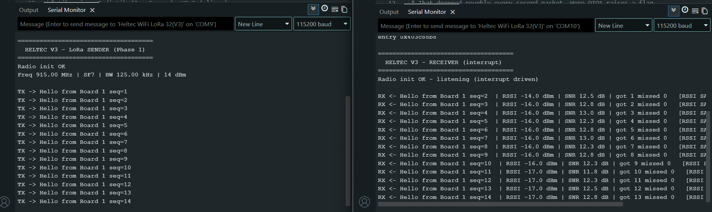

# LoRa Emergency Beacon

**Off-grid, two-way emergency communication over LoRa. No internet. No cell tower. No app to install.**

A survivor connects any ordinary phone to a WiFi hotspot broadcast by a battery-powered radio node, fills in a short web form, and their message travels several hundred metres by LoRa to a rescue base station — which can reply back to them.

Built and field-tested on Heltec WiFi LoRa 32 V3 hardware (ESP32-S3 + SX1262).

<p align="center">
  
  
</p>

---

## Why this exists

After an earthquake or flood, cell towers fail and internet goes down — usually at the exact moment people most need to reach help. Satellite messengers work, but a survivor has to already own one.

Almost everyone is holding a smartphone. This project uses that phone as the user interface, and LoRa as the transport, so a survivor needs no special hardware, no app, and no prior setup.

This is a working proof of concept for the messaging layer of my final-year project, an **Adaptive UAV-Based Emergency Communication Network**, where the relay nodes are airborne rather than on the ground.

---

## How it works

```
  Survivor's phone                Node 1                    Node 2              Rescue phone
  ────────────────                ──────                    ──────              ────────────
                     WiFi AP                    LoRa 915MHz            WiFi AP
   any browser  ──────────────►  ESP32-S3  ═══════════════►  ESP32-S3  ──────────────►  dashboard
                                  SX1262                      SX1262
                ◄──────────────            ◄═══════════════            ◄──────────────
                  reply shown                  reply packet               reply typed
```

**Node 1 — Survivor Beacon**
Broadcasts an open WiFi network called `SurvivorBeacon`. A captive-portal DNS server means most phones pop the form open automatically on connect. The survivor enters their name, group size, and situation. The message is packed into a LoRa frame and transmitted.

**Node 2 — Rescue Base**
Listens continuously on LoRa. Broadcasts its own WiFi network, `RescueBase`, serving a live dashboard of every survivor who has called in — sorted with SOS alerts pinned to the top, each card showing signal strength and time since contact. Rescue workers reply with one-tap responses or free text.

Neither node touches the internet at any point.

---

## Demonstration

| | |
|---|---|
|  | **Survivor form.** Served over the captive portal — the phone opens it automatically on joining the network. Situation is a dropdown so it stays usable under stress and with poor literacy. |
|  | **Rescue dashboard.** SOS pinned to the top with a red border. Signal bars derived from live RSSI give the rescue team a rough sense of distance. |
|  | **Reply, received.** The rescue team's message arrives back on the survivor's phone. The page self-refreshes every 8 seconds. |
|  | **Node status.** Onboard OLED shows connected phones and messages sent, so the node is usable without a laptop attached. |

---

## Measured performance

All figures below are measured, not taken from a datasheet.

### LoRa link — beacon to base station

| Test | Environment | Distance | RSSI at limit | Packet loss |
|---|---|---|---|---|
| Bench | Indoor, ~3 m | 3 m | −55 dBm | 0 / 19 |
| Sustained | Indoor, ~5 m | 5 m | −48 to −62 dBm | 0 / 82 |
| Urban NLOS | Through a multi-storey building | 300 m | −102 dBm | link failure |
| Road path | Predominantly line of sight | **693 m** | −110 dBm | link failure |

The 300 m test was deliberately hostile: transmitter on an upper floor, receiver inside a shopping complex at ground level, with a stairwell and several intervening retail units in the path. **No line of sight at any point.**

The 693 m test followed a road with two curves partially obstructing the path, both nodes at ground level. In both field tests the receiver was carried outward until the link failed, so these are measured limits rather than points at which testing stopped.

**The comparison between them is the interesting result.** Free-space path loss from 300 m to 693 m accounts for 7.3 dB. The measured difference was 8 dB. Over more than twice the distance, the road path added essentially nothing beyond geometric spreading — while the building imposed an estimated 40–60 dB penalty. Environment, not distance, governs range here.

One anomaly is recorded honestly rather than smoothed over: both tests failed 13–21 dB above the theoretical SF7 demodulation floor of −123 dBm. The consistency across two very different environments points to an elevated ambient noise floor rather than a hardware limit. A spreading factor sweep would settle it, and is the top item on the follow-on list.

Clear line-of-sight performance remains unmeasured, and no figure is claimed for it.

Full methodology, obstruction analysis and limitations: **[docs/range-test.md](docs/range-test.md)**

### WiFi link — phone to beacon

The system has two wireless links, and the WiFi hop sets how far a survivor can be from a beacon and still use it. Measured outdoors on a clear path, beacon at 0.91 m, phone carried at waist height.

| Distance | 10 m | 20 m | 30 m | 40 m | 50 m | 60 m | 70 m | 80 m | 84 m |
|---|---|---|---|---|---|---|---|---|---|
| RSSI (dBm) | −72 | −65 | −74 | −78 | −74 | −83 | −80 | −90 | −92 |
| Usable | Y | Y | Y | Y | Y | Y | Y | Y | **N** |

**Maximum usable range: 80 m.** Total failure at 84 m.

All three thresholds — SSID visibility, association, and page load — failed together. No distance existed where the phone stayed connected but could not load the page, which means visibility in the WiFi list is a reliable proxy for usable connectivity here.

Fitting the data gives a path loss exponent of **n = 2.24** against 2.0 for free space, and total attenuation from 10 m to 84 m agrees with free-space theory to within 1.5 dB. Point-to-point scatter was substantial (RMS residual 4.94 dB) and signal strength increased with distance at three points — analysed in the doc, with two competing explanations and no conclusion drawn between them pending a controlled repeat.

### Why the architecture uses both

| Link | Frequency | Measured range |
|---|---|---|
| WiFi, phone to beacon | 2.4 GHz | **80 m** |
| LoRa, beacon to base | 915 MHz | **693 m** |

**8.7× difference**, both measured outdoors at ground level. This ratio is the quantitative case for the design: WiFi for the last tens of metres to a device the survivor already owns, LoRa for the hundreds of metres WiFi cannot cross.

At an 80 m radius each beacon covers about 2 hectares, which makes this a per-building or per-block system rather than an area-coverage one.

Full methodology, path-loss mathematics, and raw CSV: **[docs/wifi-range-test.md](docs/wifi-range-test.md)**

<p align="center">
  
</p>

---

## Hardware

| Item | Qty | Notes |
|---|---|---|
| Heltec WiFi LoRa 32 V3 | 2 | ESP32-S3FN8 + SX1262 + SSD1306 OLED |
| 915 MHz whip antenna | 2 | Ships with the board |
| USB-C data cable | 2 | Charge-only cables will not enumerate |
| USB power bank | 1 | For untethered field testing |

Roughly $50 for the pair.

> **Frequency note.** These boards are the 915 MHz variant (US/ISM band). Pakistan's licence-exempt sub-GHz allocation is normally 433 MHz. All testing here was conducted at low power in a lab and prototype context; a real deployment would need hardware matched to local allocation.

> **Always attach the antenna before powering the board.** Transmitting into an open connector can permanently damage the power amplifier.

---

## Build it yourself

**1. Arduino IDE setup**

Install the ESP32 board package, then select **Heltec WiFi LoRa 32(V3)**.

| Setting | Value |
|---|---|
| USB CDC On Boot | Disabled |
| PSRAM | QSPI PSRAM |
| Upload Speed | 115200 |

**2. Libraries**

- [RadioLib](https://github.com/jgromes/RadioLib) by Jan Gromeš — drives the SX1262
- [U8g2](https://github.com/olikraus/u8g2) by oliver — drives the OLED

**3. Windows driver**

The board enumerates through a CP2102 USB-UART bridge. Windows 11 does not ship the VCP driver — without it the device appears under *Other devices* in Device Manager with no COM port. Install the [Silicon Labs CP210x VCP driver](https://www.silabs.com/developer-tools/usb-to-uart-bridge-vcp-drivers).

**4. Flash**

```
firmware/02_survivor_beacon/  →  Board 1
firmware/03_rescue_base/      →  Board 2
```

If upload stalls at `Connecting......`: hold **PRG**, press and release **RST**, release **PRG**, then upload.

**5. Use**

- Connect a phone to WiFi `SurvivorBeacon` → form opens automatically, or browse to `192.168.4.1`
- Connect a second device to WiFi `RescueBase` → dashboard at `192.168.4.1`

---

## Repository layout

```
firmware/
  00_hardware_id/        board and radio identification probes (see below)
  01_link_test/          minimal TX and RX, for verifying a new pair of boards
  02_survivor_beacon/    Node 1 — WiFi AP, captive portal, form, LoRa TX/RX
  03_rescue_base/        Node 2 — LoRa RX/TX, dashboard, reply interface
  wifi_range_test/       instrumented AP build for WiFi range measurement
docs/
  range-test.md          LoRa range methodology and results
  wifi-range-test.md     WiFi range methodology, path-loss analysis
  wifi-range-data.csv    raw WiFi measurements
  hardware-notes.md      pinout, gotchas, and how the board was identified
images/
```

---

## Two problems worth reading about

Both are documented in full in [docs/hardware-notes.md](docs/hardware-notes.md).

### The board was not what the documentation said

The project was planned around a TTGO LoRa32 T3 V1.6 (ESP32 + SX1276). The first upload failed with:

```
A fatal error occurred: This chip is ESP32-S3, not ESP32.
```

The board was an ESP32-S3 — but which one? Several manufacturers ship visually near-identical ESP32-S3 + LoRa boards with incompatible pinouts and different radio silicon. Rather than guess, I wrote [`firmware/00_hardware_id`](firmware/00_hardware_id) — a probe that sweeps the candidate SPI and I²C pin maps of the common board families and reports which one responds.

It came back empty on every candidate, which was itself informative: two independent buses finding nothing meant the pin map was wrong, not the hardware. The board turned out to be a **Heltec WiFi LoRa 32 V3**, whose OLED is powered behind a `Vext` control pin (GPIO 36, active LOW) and is therefore invisible to an I²C scan until that rail is enabled.

The radio was separately confirmed as an **SX1262** by [`firmware/00_hardware_id/radio_id.ino`](firmware/00_hardware_id), which runs four independent checks: BUSY line behaviour, the SX127x version register at `0x42`, driver-level initialisation, and transmit power ceiling. The seller's listing specified SX1276 — a common error, since Heltec V2 used that chip and V3 does not.

### Blocking reads made the radio deaf

The first receiver used RadioLib's blocking `receive()`. It dropped exactly every second packet:

```
RX <- seq=1  ... missed 0
RX <- seq=3  ... missed 1
RX <- seq=5  ... missed 2
```

The radio was not listening while the sketch printed to serial and pushed a frame to the OLED over I²C. That housekeeping took long enough to fall permanently out of phase with the 2-second transmit cycle.

The fix was interrupt-driven reception: DIO1 raises a flag, the ISR does nothing but set it, and `startReceive()` is called *before* any slow work rather than after. Deaf window went from hundreds of milliseconds to microseconds.

<p align="center">
  
</p>

This matters beyond a demo. A relay node that goes deaf while updating a display drops traffic under load — precisely the defect that shows up later as unexplained packet loss in a multi-node network.

---

## Known limitations

- **No encryption.** Messages are transmitted in clear text. Fine for a proof of concept, unacceptable for deployment.
- **No authentication.** Any device on the frequency with the right sync word can inject packets.
- **Two nodes only.** No routing, no relaying, no mesh. Range is a single hop.
- **No persistence.** Messages live in RAM and are lost on reset. The Heltec V3 has no SD slot, so adding storage means an external module or writing to internal flash.
- **Collision handling is naive.** A random 20–180 ms backoff before transmit, nothing more. This will not scale past a handful of nodes.
- **No GPS.** Survivor location is whatever they type into the message field.
- **Single measurement run per test condition.** No repeated trials or statistical averaging.
- **WiFi indoor, through-wall and through-floor ranges unmeasured.** Only the outdoor clear-path case has been characterised, and the obstructed cases are the operationally relevant ones.

---

## Where this goes next

- Multi-hop relaying between more than two nodes
- Message persistence with RSSI and timestamp logging, either to internal flash or an external SD module
- GPS module for automatic survivor positioning
- Payload encryption
- Airborne relay node — the actual subject of my final-year project

---

## Author

**Muhammad Mubeen Syed**
Electrical Engineering, Ghulam Ishaq Khan Institute (GIKI), Pakistan
Captain, Team Techno 

Built in a single session, 1 August 2026.

## License

MIT — see [LICENSE](LICENSE).
